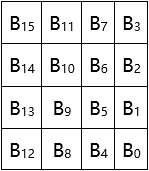
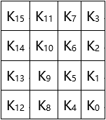
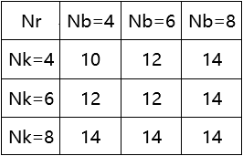
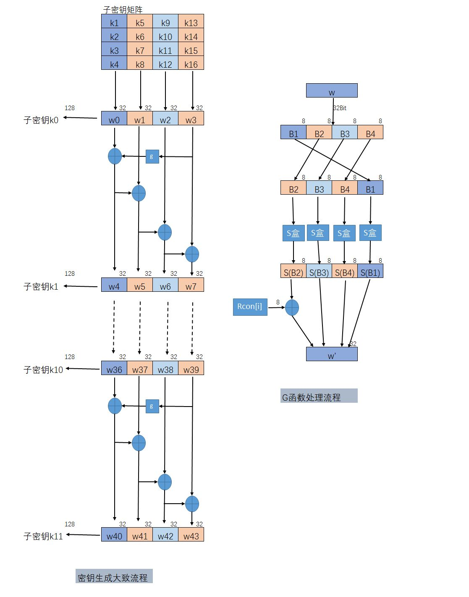

## 1. 简介

**进阶加密标准**（英语：**A**dvanced **E**ncryption **S**tandard，[缩写](https://zh.wikipedia.org/wiki/缩写)：AES），又称**Rijndael加密法**（荷兰语发音：[[ˈrɛindaːl\]](https://zh.wikipedia.org/wiki/Help:荷蘭語國際音標)，音似英文的“Rhine doll”），是[美国联邦政府](https://zh.wikipedia.org/wiki/美国联邦政府)采用的一种[区块加密](https://zh.wikipedia.org/wiki/區塊加密)标准。这个标准用来替代原先的[DES](https://zh.wikipedia.org/wiki/DES)，已经被多方分析且广为全世界所使用。经过五年的甄选流程，进阶加密标准由[美国国家标准与技术研究院](https://zh.wikipedia.org/wiki/美国国家标准与技术研究院)（NIST）于2001年11月26日发布于FIPS PUB 197，并在2002年5月26日成为有效的标准。现在，进阶加密标准已然成为[对称密钥加密](https://zh.wikipedia.org/wiki/对称密钥加密)中最流行的[演算法](https://zh.wikipedia.org/wiki/演算法)之一。

该演算法为[比利时](https://zh.wikipedia.org/wiki/比利时)密码学家Joan Daemen和Vincent Rijmen所设计，结合两位作者的名字，以Rijndael为名投稿进阶加密标准的甄选流程。<!--摘自wikipedia-->

## 2. 结构

### 2.1 总体结构

AES是典型的块加密算法，明文分组长度为128bits(16Bytes),密钥长度为128bits,192bits或256bits。根据密钥长度，算法被称为AES-128,AES-192 OR AES-256。下图展示了AES-128加密标准的总体结构。

如图所示，在加密过程分为一下几个步骤：

- 初始轮只进行轮密钥加
- 1-9轮执行循环模块，模块中包含以下内容
  - 字节代替
  - 行移位
  - 列混淆
  - 轮密钥加
- 第10轮执行循环模块**除了列混淆**以外的操作

### 2.2 AES参数

#### 2.2.1 数据块字数Nb

　　在AES算法中，加解密要经过多次数据变换操作，每一次变换操作都会产生一个中间结果，这个结果称为状态。把状态表示为一个4行Nb列的二维字节数组，其中Nb为数据块长度除以32。因为状态数组有4行，所以状态数组的每一列便为一个4字节的字。

　　例如，对于长度为128的数据块B15B14...B1B0，Nb=128÷32=4，即该数据块可以表示为状态数组

　　AES算法中规定数据块长度为128位，即Nb=128÷32=4。

#### 2.2.2 密钥字数Nk

　　类似地，密钥也可以表示为4行Nk列的二维字节数组，其中Nk为密钥长度除以32。同样地，密钥数组的每一列为一个4字节的字。

　　例如，对于长度为128的密钥K15K14...K1K0，Nk=128÷32=4，即该密钥可以表示为密钥数组

　　AES算法中规定密钥长度为128位、192位或256位，即Nk取值为4、6或8。

#### 2.2.3 迭代轮数Nr

　　AES算法的迭代轮数Nr由Nb和Nk共同决定：

　　AES规定Nb=4，所以对应Nk取值4、6、8，Nr取值分别为10、12、14，即在Nb=4的情况下，Nr=Nk+6。

#### 2.2.4 不可约多项式m(x)

　　在AES算法中，不可约多项式建议为：m(x)=x8+x4+x3+x+1，其系数的十六进制表示为m='11B'。

### 2.3 详细结构

接下来详细介绍上文中的循环模块的内容，并通过该内容引伸其他相关的内容

#### 2.3.1 字节代替(Substitute Bytes)

一个简单的查表操作，用S盒完成字节的映射。我们先将输入的16Bytes转换成4*4的方阵，每个元素的高4位作为行号，低4位作为列号与S盒中对应的元素进行映射。

**S盒(Substitution-box)**

由16*16个字节组成，包含了8位所能表示的所有256个数的矩阵。在AES算法中，S盒通常是固定的，由如下步骤生成。

1. 按字节值的升序依次将{00}~{FF}填入盒中。如第一行是{00},{01}……{0F}

2. 把S盒中的每个字节映射为他在**GF(28)**中的逆，{00}被映射为自身。

3. 把S盒中每个字节转成二进制并标记为（b7,b6,b5,b4,b3,b2,b1,b0)。

   bi'=bi⊕b(i+4) mod 8⊕b(i+5) mod 8⊕b(i+6) mod 8⊕b(i+7) mod 8⊕ci

   注：ci指（01100011）的第i位（从右往左）

   如：{95}的逆为{8A}，二进制为(10001010)转换后变为(00101010)即{2A}。可以从下图验证

   

#### 2.3.2 行移位(ShiftRows)

一个简单的置换。将输入的4*4矩阵按如下方式进行移位

- 第一行不变
- 第二行循环左移1位
- 第三行循环左移2位
- 第四行循环左移3位

#### 2.3.3 列混淆(MixColumns)

一个矩阵乘法。用一个固定的矩阵与输入的4*4矩阵进行相乘。

值得注意的是，乘积矩阵中的乘法和加法都是定于**GF(28)**上的。

#### 2.3.4 轮密钥加(AddRoundKey)

与扩展密钥组的一个XOR操作。要理解轮密钥加首先要了解密钥扩展算法。

**密钥扩展算法**

密钥扩展算法的输入是4Bytes的密钥,输出值是44字节组成的一维线性数组。

11*4Bytes，分别用于每一次的轮密钥加操作(轮密钥为4Bytes)。具体步骤如下图所示：

步骤中主要涉及的操作依然是XOR、移位、和S盒映射。此处不再一一介绍。

值得一提的分别是：

- G函数中的字循环移位操作为循环向左移位，这与ShiftRows的方向相同

- Rcon[i]是轮常量数组。Rcon[i]=（Rc[i],0,0,0)。Rc[1]=1，Rc[i]=2*Rc[i-1]（此处的乘法是定义在域GF(28)上的）按也可以直接查表，如下：

  | i                | 1    | 2    | 3    | 4    | 5    | 6    | 7    | 8    | 9    | 10   |
  | ---------------- | ---- | ---- | ---- | ---- | ---- | ---- | ---- | ---- | ---- | ---- |
  | Rc[i] | 01   | 02   | 04   | 08   | 10   | 20   | 40   | 80   | 1B   | 36   |

  

以上即是加密过程，解密过程为加密的逆操作，故不做说明。

## 3.思考题

### 3.1 Rijndael 与 AES有何不同？

Rijndael 允许加密快长度为128、192 or 256 bits，AES 只允许块长度为 128 bits.

### 3.2 使用状态数组的目的是什么？

状态数组用于储存 128 bits块每次执行数据变换操作产生的中间结果

