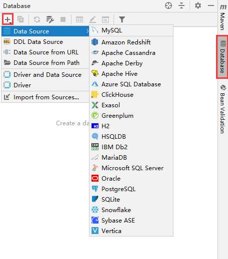
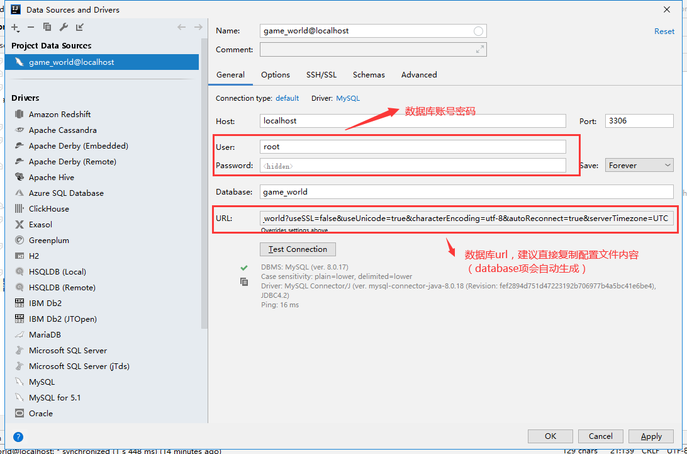
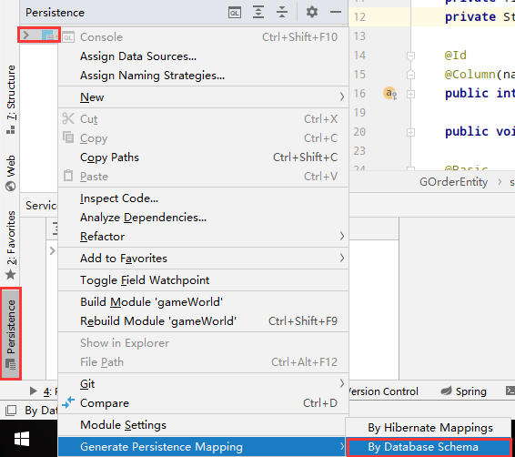
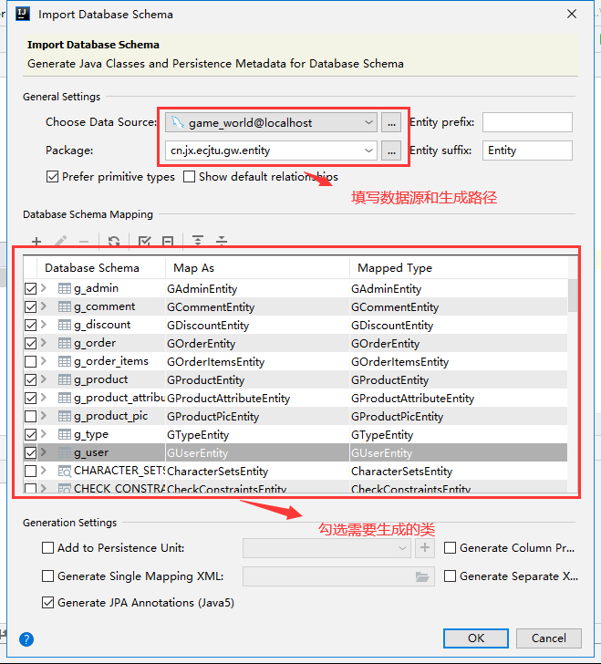

## 自动生成jpa实体类

数据库设计完毕后，建立实体类并没有太多技术含量，通常只是一些重复、繁琐的工作，并且建立完成后还需要进行测试，浪费时间。idea自带的这款功能可以很好的解决这个问题，建立完成后，只需要再进行极少的修改即可直接使用。以下是使用流程，作为记录方便下次查看。

1. 使用idea连接数据库

2. 填写连接需要的参数 并进行连接测试

	

3. 此时 idea的database功能以配置完毕，现在可以生成实体类了。请打开Persistence窗口

	

4. 填写批量生成的相应参数

	

ok，实体类生成完毕，剩下的就是增添一些映射关系和根据情况进行修改。个人认为是很不错的工具。