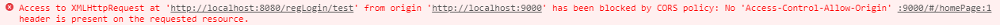

SpringBoot采用约定大于配置的方式为用户提供大量的默认配置，当默认配置不满足需求时，我们通过配置```yml```或者编写配置类的方式来完善它。此篇blog简单介绍了如何通过代码的形式配置webMvcConfig完成跨域。

#### 工作原理

**SpringBoot官方介绍**

If you want to keep Spring Boot MVC features and you want to add additional [MVC configuration](https://docs.spring.io/spring/docs/5.2.1.RELEASE/spring-framework-reference/web.html#mvc) (interceptors, formatters, view controllers, and other features), you can add your own ```@Configurationclass``` of type ```WebMvcConfigurer``` but **without** ```@EnableWebMvc```. If you wish to provide custom instances of``` RequestMappingHandlerMapping```, ```RequestMappingHandlerAdapter```, or ```ExceptionHandlerExceptionResolve```r, you can declare a ```WebMvcRegistrationsAdapter``` instance to provide such components.

如上所述，我们可以通过给配置类加上```@Configuration```注解并实现```WebMvcConfigurer ```接口完成配置补全。

**注**：SpringBoot自身也是通过该方式添加默认的自动配置组件（源码在``` WebMvcAutoConfiguration```的```WebMvcAutoConfigurationAdapter```类中）

```java
@Configuration(proxyBeanMethods = false)
@ConditionalOnWebApplication(type = Type.SERVLET)
@ConditionalOnClass({ Servlet.class, DispatcherServlet.class, WebMvcConfigurer.class })
@ConditionalOnMissingBean(WebMvcConfigurationSupport.class)
@AutoConfigureOrder(Ordered.HIGHEST_PRECEDENCE + 10)
@AutoConfigureAfter({ DispatcherServletAutoConfiguration.class, TaskExecutionAutoConfiguration.class,
      ValidationAutoConfiguration.class })
public class WebMvcAutoConfiguration {
    // Defined as a nested config to ensure WebMvcConfigurer is not read when not
    // on the classpath
    @Configuration(proxyBeanMethods = false)
    //注意：这里通过@import注解导入了EnableWebMvcConfiguration
    @Import(EnableWebMvcConfiguration.class)
    @EnableConfigurationProperties({ WebMvcProperties.class, ResourceProperties.class })
    @Order(0)
    public static class WebMvcAutoConfigurationAdapter implements WebMvcConfigurer 
```

WebMvcAutoConfiguration是SpringMVC的自动配置类，在做其做自动配置时会导入```EnableWebMvcConfiguration```,其父类```DelegatingWebMvcConfiguration```实现了装配的具体功能。容器中所有的```WebMvcConfigurer```类会以**数组**的形式添加进配置类中，我们的配置自然也会生效。

```java
@Configuration(proxyBeanMethods = false)
public class DelegatingWebMvcConfiguration extends WebMvcConfigurationSupport {
    
   @Autowired(required = false)
   public void setConfigurers(List<WebMvcConfigurer> configurers) {
      if (!CollectionUtils.isEmpty(configurers)) {
         this.configurers.addWebMvcConfigurers(configurers);
      }
   }
```

#### 上手

ok，了解了以上信息，相信你对自动装配已经有了一个大概的理解，那让我们上手操作一下吧。

首先，我们在前端项目中编写一个axios请求，并在后端项目中编写控制器类。

```javascript
methods: {  
    axoisTest(){
    // 为给定 ID 的 user 创建请求
    this.$axios.get('http://localhost:8080/regLogin/test')
    .then(function (response) {
    console.log(response);
    })
    .catch(function (error) {
    console.log(error);
    });
    }
},
```

 ```java
@RestController
@RequestMapping(value = "/regLogin")
public class RegLoginController {

    @GetMapping(value = "/test")
    public String Test(){
        return "Hello Vue";
    }
}
 ```

此时发送请求，很显然，因为违反**同源策略**（Sameoriginpolicy）会报错“请求被封锁”



此时编写webConfig类后再次发送请求

``` java
@Configuration
public class webConfig implements WebMvcConfigurer {

    @Override
    public void addCorsMappings(CorsRegistry registry) {
        registry.addMapping("/**")						//指定允许访问的内容**表示允许所有
                .allowedOrigins("http://localhost:9000")  //指定允许跨域访问的域
                .allowCredentials(true)					//指定是否允许
                .allowedMethods("GET", "POST", "DELETE", "PUT", "PATCH")
                .maxAge(3600 * 24);

    }
}
```

成功获取信息


