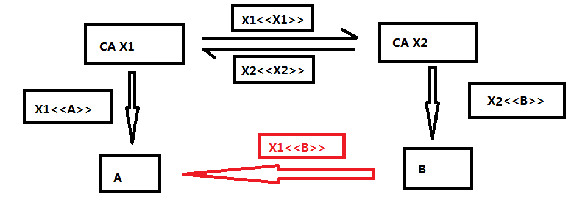

## 为什么使用证书

在证书出现之前，人们使用公钥算法保证信息安全。任何参与者都可以给其他参与者发送自己的公钥，这种方法很方便但是存在一个缺点。任何人都可以伪造公用通告，这是很致命的。

我们把公钥加密当做一个身份验证，这个身份验证不用经过任何权威机构的认证，而是由用户自身所生成。在这种情况下，任何人都可以伪装成你。

为了解决这个问题，公钥证书出现了。公钥证书由**公钥**、**公钥所有者的用户ID**、**可信的第三方签名的整个数据块**组成。如今人们广泛接受的公钥证书格式是X.509标准，以下对其进行探讨。

## X.509证书

### 证书结构

- 版本号
- 序列号
- 签名算法标识符
  - 算法
  - 参数
- 发放者名称
- 证书有效期
  - 生效日期
  - 失效日期
- 主体名称
- 主体公钥信息
  - 公钥算法
  - 参数
  - 主体公钥
- 颁发者唯一标识符（可选项）
- 主体唯一标识符（可选项）
- 扩展信息（可选项）
- 证书签名算法
- 签名
  - 算法
  - 参数
  - 加密后的内容

::: tip

CA用它的**私钥**对证书中内容进行签名，如果用户知道相应的公钥，那该用户就可以验证由CA签名过的证书是否合法，这是一个典型的数字签名方法。

:::

### 特征及作用

**由CA生成的用户证书有如下特征**：

- 任何可以访问CA公钥的用户都可以验证此经过签名的用户公钥（关于数字签名的理解可以点击[这里](http://www.youdzone.com/signature.html)）

- 只有认证中心才可以修改用户证书而不被发现

因此，在加密算法安全的前提下，一旦B拥有了A的证书，B就可以确保：

- **他用A的公钥加密的消息是不能被前厅的** （B从证书中取得A的公钥，而证书做过了数字签名）
- **他收到的用A的私钥签名的信息是不能被伪造的** （B拥有正确的公钥，可以对A的签名进行验证）

### 证书链

由于用户数量很庞大，让一个用户预订统一的CA是不太现实的，所以引入了证书链的概念。

定义：**信任链**，或称**数字证书链**，是一连串的[数字证书](https://zh.wikipedia.org/wiki/電子證書)，由[根证书](https://zh.wikipedia.org/wiki/根证书)为起点，透过[层层信任](https://zh.wikipedia.org/wiki/传递关系)[[1\]](https://zh.wikipedia.org/wiki/信任鏈#cite_note-1)，使[终端实体证书](https://zh.wikipedia.org/wiki/公開金鑰認證#終端實體證書)的持有者可以获得转授的信任[[2\]](https://zh.wikipedia.org/wiki/信任鏈#cite_note-2)，[以证明身份](https://zh.wikipedia.org/wiki/身分标识方式)。（来源：wiki百科）

举个例子：

​	存在两个认证中心X1、X2分别对两个用户A、B发送了证书，此时如果B向A发送由X2下发的证书给A时，其实对A来说是没有意义的。**因为A并不信任X2且没有X2的公钥**，A可以读取B的证书，但无法验证签名。但是如果两个CA之间已经安全的交换了他们的公钥，那么就可以使A信任B的公钥。

下面叙述了A信任B的公钥的过程：

1. A从目录中得到X1签名的X2的证书，由于A知道X1的公钥，所以A此时可以拿到X2的公钥，并通过X1的签名验证它
2. 由于此时A已经可以信任X2，并拥有其公钥副本，所以此时A可以对B的签名进行验证并安全得到他的公钥。

使用X.509表示法，这个证书链可以这样表示：X1<<X2>>X2<<\B>>。

同样的，如果B可以通过反向链X2<<X1>>X1<<\A>>得到A的公钥。

这种方案不必局限于两个证书组成，任意长度的CA路径都可以用类似的方法产生一个链。

一个拥有N个要素的链可以如下表述：X1<<X2>>X2<<X3>>·····XN<<\B>>,这种情况下CA链中的每一对都必须互相生成过证书，每个CA的目录口X都包含如下两种类型的证书：

- 前向证书：由其他CA生成的X的证书
- 反向证书：由X生成的其他CA的证书

### 证书撤销

每个证书都包含一个有效期，正常情况下新证书恰好在老证书过期前发放。由于以下原因之一，有时会希望在证书过期前就将其撤销。

- 用户的私钥被认为已泄露
- 用户不再被CA信任
- CA的证书被认为已泄露

每个CA都必须存储一个包含其发放的所有**未到期而被撤销的证书列表**，这既包括给用户发放的证书，也包括给其他CA发放的证书。

撤销证书列表结构：

- 签名算法标识符

- 发放者的名称
- 此次更新日期
- 下一个CRL计划发放日期
- 已撤销的证书
  - 用户证书序列号
  - 撤销日期
- 签名

用户得到证书时，必须要确定证书是否被撤销。

注：本篇文章为 网络安全基础-应用与标准（第六版）的学习笔记。