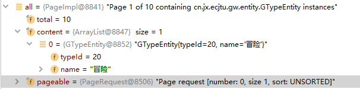

## 常用注解

@Entity	指明这是一个实体类

@Table.name()用来指定映射表的表名。

如果缺省@Table注释，系统默认采用类名作为映射表的表名。实体Bean的每个实例代表数据表中的一行数据，行中的一列对应实例中的一个属性。

@Id 标注用于声明一个实体类的属性映射为数据库的主键列	可以放在声明语句上或者属性的getter方法上

@GeneratedValue 用于标注主键的生成策略，通过strategy 属性指定。默认情况下，JPA 自动选择一个最适合底层数据库的主键生成策略：SqlServer对应identity，MySQL 对应 auto increment

@Query

自定义语句时，需要再方法名上加此注解

param:

value: 数据库语句

nativeQuery：是否使用本地查询（默认为false）

@Modifying

配置在dao层接口方法上，表示该操作是一个更新操作

（执行自定义 更新/删除 操作时 需要添加实物支持

且spring Data JPA 会默认执行结束后回滚失误 

所以需要再加上以下注解：）

@Rollback(value="false")

## 编写dao层实现类

### 流程

* 只需要编写dao层接口，不需要编写dao层接口的实现类

* dao层接口规范

1. 为类名添加@Repository注解加入Spring容器
2. 需要集成两个接口 （JpaRepository , JpaSpecificationExecutor）

2. 需要指定相应的泛型

  JpaRepository<操作的实体类类型，实体类中主键属性的类型>

​		封装了基本CRUD操作

 	JpaSpecificationExecutor<操作的实体类类型>

 		封装了复杂查询(分页)

**完成之后的dao层接口会自动拥有基本的CRUD方法 **

## 常用方法

- save():

	保存或者更新

	根据传递的对象是否存在主键id，如果没有id主键属性，则为插入insert

	否则则为更新update

	findOne()&getOne()

- findOne:

	底层调用em.find()			：立即加载

- getOne:

	底层调用em.getReference	：延迟加载

	需要在方法名上加 @Transactional 标签

	返回的是动态代理对象，并且是什么时候用什么时候才加载

	多个占位符参数

	赋值时，默认情况下，占位符的顺序需要和方法参数中的顺序保持一致

	顺序不一致时，需要在占位符后面加上参数顺序的索引（索引从1开始）

## 方法名称规则查询

约定：

findBy：查询

对象中的属性名（首字母大写），查询的条件

Name

findByName()	根据客户名称查询

| Keyword            | Sample                                                  | JPQL snippet                                                 |
| ------------------ | ------------------------------------------------------- | ------------------------------------------------------------ |
| And                | findByLastnameAndFirstname                              | … where x.lastname = ?1 and x.firstname = ?2                 |
| Or                 | findByLastnameOrFirstname                               | … where x.lastname = ?1 or x.firstname = ?2                  |
| Is, Equals         | findByFirstname,findByFirstnameIs,findByFirstnameEquals | … where x.firstname = ?1                                     |
| Between            | findByStartDateBetween                                  | … where x.startDate between ?1 and ?2                        |
| LessThan           | findByAgeLessThan                                       | … where x.age < ?1                                           |
| LessThanEqual      | findByAgeLessThanEqual                                  | … where x.age <= ?1                                          |
| GreaterThan        | findByAgeGreaterThan                                    | … where x.age > ?1                                           |
| GreaterThanEqual   | findByAgeGreaterThanEqual                               | … where x.age >= ?1                                          |
| After              | findByStartDateAfter                                    | … where x.startDate > ?1                                     |
| Before             | findByStartDateBefore                                   | … where x.startDate < ?1                                     |
| IsNull, Null       | findByAge(Is)Null                                       | … where x.age is null                                        |
| IsNotNull, NotNull | findByAge(Is)NotNull                                    | … where x.age not null                                       |
| Like               | findByFirstnameLike                                     | … where x.firstname like ?1                                  |
| NotLike            | findByFirstnameNotLike                                  | … where x.firstname not like ?1                              |
| StartingWith       | findByFirstnameStartingWith                             | … where x.firstname like ?1 (parameter bound with appended %) |
| EndingWith         | findByFirstnameEndingWith                               | … where x.firstname like ?1 (parameter bound with prepended %) |
| Containing         | findByFirstnameContaining                               | … where x.firstname like ?1 (parameter bound wrapped in %)   |
| OrderBy            | findByAgeOrderByLastnameDesc                            | … where x.age = ?1 order by x.lastname desc                  |
| Not                | findByLastnameNot                                       | … where x.lastname <> ?1                                     |
| In                 | findByAgeIn(Collection<Age> ages)                       | … where x.age in ?1                                          |
| NotIn              | findByAgeNotIn(Collection<Age> ages)                    | … where x.age not in ?1                                      |
| True               | findByActiveTrue()                                      | … where x.active = true                                      |
| False              | findByActiveFalse()                                     | … where x.active = false                                     |
| IgnoreCase         | findByFirstnameIgnoreCase                               | … where UPPER(x.firstame) = UPPER(?1)                        |

## 动态查询

### 自定义查询条件

1、实现Specification接口（提供泛型-查询对象的类型）

2、实现toPredicate方法（构造查询条件

3、需要借助方法参数中的两个参数

​	root：获取需要查询的对象属性

​	CriteriaQuery: 顶层的查询对象，自定义查询方式

​	CriteriaBuilder：构造查询条件的，内部封装了很多查询条件（模糊查询，精准匹配）

### 排序：

创建排序对象，通过构造方法实例化

构造方法的第一个参数：排序的顺序（正序，倒序）

Sort.Direction.DESC:正序

Sort.Direction.ASC:正序

第二个参数：排序依据的属性名称

### 分页：

Pageable：分页参数

分页参数：查询的页码，以及每页查询的条数

返回：Page(springDataJpa封装好的pageBean对象。包含了数据列表、总条数等信息)

**操作步骤**

1、明确表关系

2、确定表关系（描述 外键 | 中间表）

3、编写实体类，在实体类中描述表关系（包含关系）

4、配置映射关系                   

## 使用注解的方式配置多表关系

1. 声明关系

 		@OneToMany : 配置一对多关系

​		targetEntity ： 对方对象的字节码对象

2. 配置外键（或中间表）

​		@JoinColum : 配置外键

​			name ： 外键字段名称

​			referencedColumnName : 参照的主表的主键名字段名称（依数据库为准）

 **配置联系人到客户的多对一关系**

​	使用注解的形式配置多对一关系

1. 配置表关系

	@ManyToOne:配置多对一关系

	targetEntity ： 对方的实体类字节码 。表示与其关联

	mappedBy： 对象配置关系的属性名称。表示放弃维护全关联

	cascade ： 配置级联(值为枚举对象)

	​	CascadeType.REMOVE 	删除

	​	CascadeType.MERGE	更新

	​	CascadeType.PERSIST 	保存

	​	CascadeType.ALL	 	所有

	fecth ： 加载策略。

	​		FetchType.EAGER（

	​		FetchType.LAZY(默认)

	### 注解配置多对多关系

	1. 声明表关系的配置

		@ManyToMany（targetEntity = *.class） //填入需要配置关系的实体类字节码

		@JoinTable(name= "中间表名称", 

		joinColumns = {@JoinColum(name = "当前对象在中间表中的外键")}，

		inverseJoinColumns = {@JoinColum(name = "对方表在中间表的外键")}

		)	

	2. 配置中间表（包含两个外键）

## 对象导航查询：

默认使用延迟加载的形式查询的

调用get方法并不会立即发送查询，而是在使用关联对象的时候才会查询（延迟加载）

修改配置，将延迟加载改为立即加载

fetch需要配置到夺标映射关系的注解上

​	2、配置外键（中间表）

​		@JoinColumn

​			name : 外键的字段名

​	 			referencedColumnName ： 外键参照的主表的主键名字段名称

​	 注意：在类中配置双向关系时，应该在其中一个外键字段注释@JoinColumn(insertable=false,updatable=false)否则会因为同一个字段重复注册报错，导致容器无法初始化？有没有更好的解决办法

@NameEntityGraph

配置在@Entity上面

@EntityGraph

配置在dao层的方法上面

## 分页

Jpa内置分页方法```findAll(Specification<> ,pageable)``` 或 ```findAll(Pageable)```方法

- Specification: 查询条件
- Pageable：分页参数

这两个方法都会返回一个Page对象（SpringDataJpa封装好的JavaBean）

```java
@Test
public void testSpec() {
    Specification spec = null;
    /**
     * PageRequest： Pageable的实现类
     * 		第一个参数： 当前查询的页数
     *		第二个参数： 每页查询的数量
     *		第三个参数： sort 排序方法
     */
    Pageable pageable = new PageRequest(0,5);
    Page<Customer> pages = customerDao.findAll(spec,pageable);
}
```

::: warn

在新版本中.pageRequest的构造方法已被启用，修饰符为protect，创建PageRequest的方式应该改为PageRequest.of(...);

:::

**Page对象常用方法**

- page.getContent() ：获取数据集合列表
- page.getTotalElements()：获取总条数
- page.getTotalPages()：得到总页数

注： jpa的分页方法为物理分页，适合数据库储存量较大的情形

.png)




