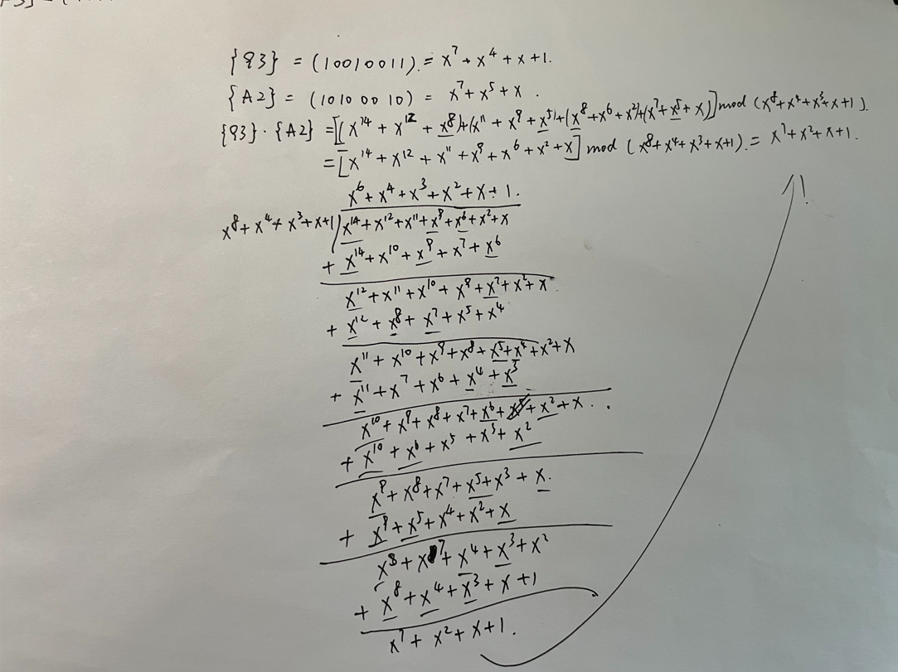
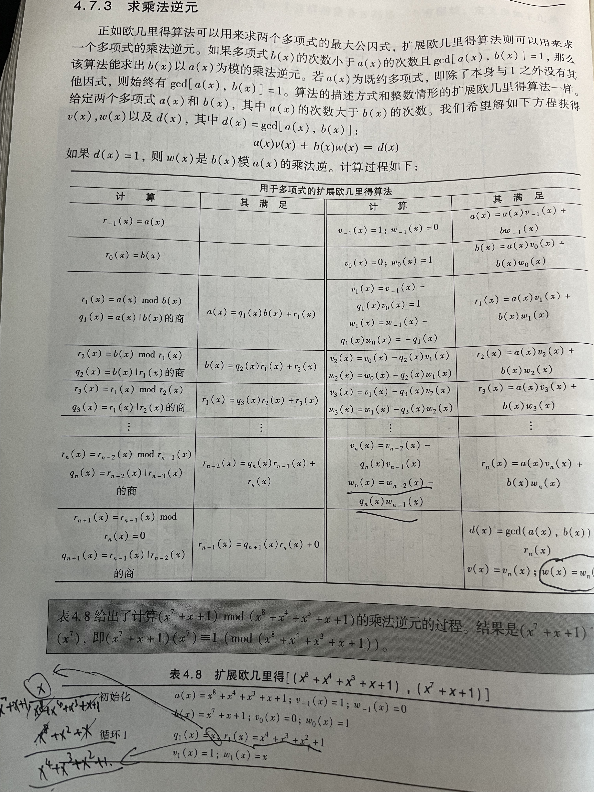
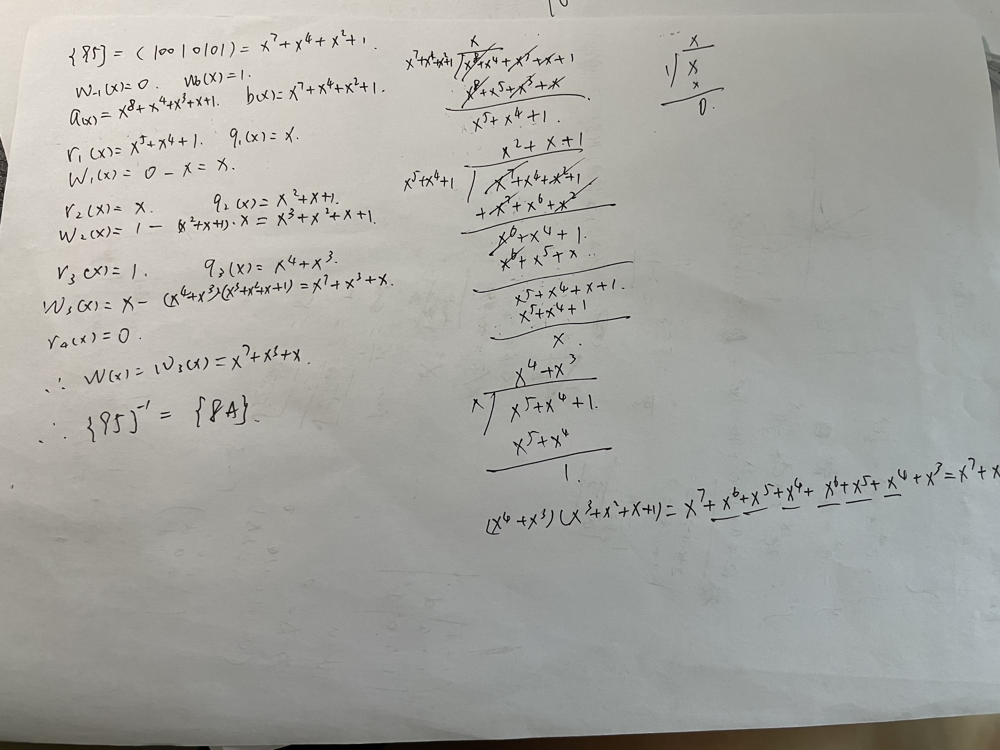

简单记录以下GF(28)的运算规则

## 1. GF(28)中运算规则

GF(28)中的运算为多项式运算。多项式的系数在GF(28)中，且多项式被定义为**模一个n次多项式m(x)的多项式运算**。我们首先介绍如何将两位十六进制的数表示为多项式再介绍相关的计算规则。

1. 多项式形式

   GF(28)中每个多项式具有如下形式：

   f(x) = an-1xn-1+an-2xn-2+……+a1x1+a0

   其中，ai在集合{0，1}上取值，n=8

2. 不可约多项式

   上文有提到多项式多项式被定义为模一个n次多项式m(x)的多项式运算。GF(28)中有很多不可约多项式，使用者必须定义该多项式。AES使用的不可约多项式为**M(x)=x8+x4+x3+x+1**,本文以此为例。

3. 16进制转换成多项式

   GF(28)是含有28个元素的有限域，用16进制表示为{00}~{FF}的256个数。将其转换多项式需要以下几个步骤：

   1. 将16进制转换成2进制 如:{A5} -> (10100101)
   2. 将2进制的每一位依次填入f(x)的系数 如：(10100101) -> f(x)=x7+x5+x2+1

## 2. GF(28)的加法

首先要知道，减法运算可以视为加上一个数的加法逆。在GF(28)中，一个数的加法逆就是这个数本身。而GF(28)中的加法被定义为对位异或，也可理解为对多项式系数的XOR。

如:{F3} + {A2} = {F3} - {A2}  = (11110011) + (10100010) = (01010001)

亦可表示为: (x7+x6+x5+x4+x+1) + (x7+x5+x) = (x6+x4+1)

## 3. GF(28)的乘法

GF(28)中的乘法可以简单理解为多项式相乘后模**不可约多项式**，以{93} ,{A2}为例运算过程如下图：

计算过程没有难点，手算面临最大的问题就是粗心。上图只展示计算过程，结果并没有经过验算。之后有空把计算器写出来再更新此处。

## 4. GF(28)的乘法逆

网上没有找到合适图例，手写又比较麻烦，只好上教材了。

附上带计算过程的例子{95}-1={8A} (本例经过验算)

